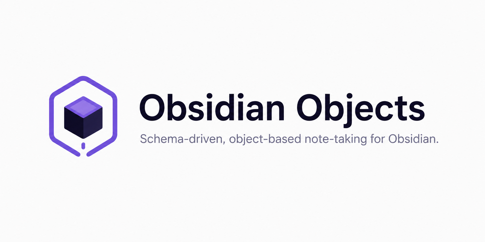

# Obsidian Objects

<p align="center">
  
</p>

<p align="center">
  <a href="https://github.com/andrewmcodes/obsidian-objects/actions/workflows/lint.yml"></a>
  <a href="https://github.com/andrewmcodes/obsidian-objects/releases/latest"></a>
  
  <a href="LICENSE"></a>
</p>

Schema-driven, object-based note-taking for [Obsidian](https://obsidian.md), built entirely on native Markdown, Properties, and Bases.

Define object schemas (Person, Project, Book, Meeting, …), create structured object notes through a modal, and browse them with native Bases. Everything is stored in plain Markdown with Properties — if you disable or uninstall the plugin, all your data remains fully accessible.

## Features

- **Schema-driven objects** — each object type defines its folder, filename template, properties, body templates, and validation rules.
- **Creation modal** — pick a type, fill in fields (with autocomplete and validation), choose a template, and get a note with valid Properties.
- **Dynamic commands** — every schema gets a `Create <Schema>` command, plus a generic **Create object** picker.
- **Promote selection** — turn selected text into an object and replace it with a `[[wikilink]]`.
- **Native Bases** — the **Generate Bases** command writes `.base` files (table and card views) that filter on the `type` property and are rendered natively by Obsidian — no custom view code.
- **Dashboard** — a sidebar view lists every object grouped by type for quick browsing.
- **Local-first** — no external services, no proprietary storage. Required `type` and `created_on` properties are added automatically.

## Property types

`text`, `textarea`, `number`, `date`, `checkbox`, `select`, `multiselect`, `link`, `multilink` (wikilink relationships), `email`, `url`.

## Beyond the basics

- **Relationships** — `link`/`multilink` properties store `[[wikilinks]]`, with note autocomplete that can be scoped to a specific object type (e.g. a meeting's attendees only suggest people).
- **Multiple templates** — schemas can define named body templates to choose from when creating an object.
- **Validation rules** — properties support regex patterns, number min/max, and email/url format checks, enforced in the creation modal.
- **Object actions** — schemas can define custom commands for their notes (set a property, append a template section, or create a linked object).
- **Schema sharing** — export schemas to JSON and import them in another vault.

## Getting started

1. Install and enable the plugin in **Settings → Community plugins**.
2. On first run, default schemas (Person, Project, Meeting, Book, Article, Idea) are created. Manage them in the **Objects** settings tab.
3. Run **Create object** (or a `Create <Schema>` command) from the command palette.

## Commands

- **Create object** — open the object type picker, then the creation modal.
- **Create _&lt;Schema&gt;_** — create an object of a specific type directly.
- **Promote selection to object** — convert selected text into a new object.
- **Generate Bases** — write a `.base` file per schema (table + card views).
- **Open dashboard** — open the objects dashboard in the sidebar.
- **Export schemas to clipboard** / **Import schemas** — share schemas as JSON.
- **Open settings** — open the Objects settings tab.

## Settings

The **Objects** settings tab lets you:

- Configure the default folder, Bases folder, and whether notes open on create.
- Add, edit, delete, and reorder schemas.
- Edit each schema's id, label, folder, filename template, body template, and properties (including options for `select`/`multiselect`).

## Data model

Every object note is a standard Markdown file. Required Properties are always present:

```markdown
---
type: project
created_on: 2026-06-17
status: active
---

# Vite Migration

## Notes
```

The `type` property is the single source of truth for classification — the plugin never infers type from folders, tags, or file location.

## Development

This project uses [`mise`](https://mise.jdx.dev/) for tasks and **pnpm via Corepack** for dependencies.

```bash
mise run install   # install dependencies (corepack pnpm install)
mise run dev       # esbuild watch build
mise run build     # type-check + production bundle
mise run check     # lint + format-check + build + test
mise run hooks     # install the commit-msg git hook
```

Requires **Obsidian 1.13+**. To install into a local vault, build and copy `main.js`, `manifest.json`, and `styles.css` into `<Vault>/.obsidian/plugins/obsidian-objects/`. Convenience task (quote the path; a leading `~` is expanded by the task):

```bash
OBSIDIAN_VAULT="~/git/andrewmcodes/digital-brain" mise run install-plugin
```

Then in Obsidian: enable **Settings → Community plugins** (turn off Restricted mode if prompted), reload the app, and enable **Objects** under **Installed plugins**. A manually-installed plugin shows up there — **not** in the **Browse** catalog, which only lists submitted community plugins.

### Testing locally

- **Unit tests** (pure logic) run with [Vitest](https://vitest.dev/):

  ```bash
  mise run test          # one-off
  pnpm test:watch        # watch mode
  ```

- **Manual testing** in a real vault — the UI (modals, dashboard, commands, generated Bases) is exercised by hand in Obsidian. For a live loop, install the [Hot Reload](https://github.com/pjeby/hot-reload) plugin and point the build at your vault so it rebuilds and reloads on every change:

  ```bash
  OBSIDIAN_VAULT="/path/to/your/vault" mise run dev
  ```

  Otherwise run `mise run install-plugin` and reload Obsidian after each build.

See [`AGENTS.md`](AGENTS.md) and [`docs/conventions/CONVENTIONS.md`](docs/conventions/CONVENTIONS.md) for the full contributor guide and conventions.

## License

[MIT](LICENSE)
